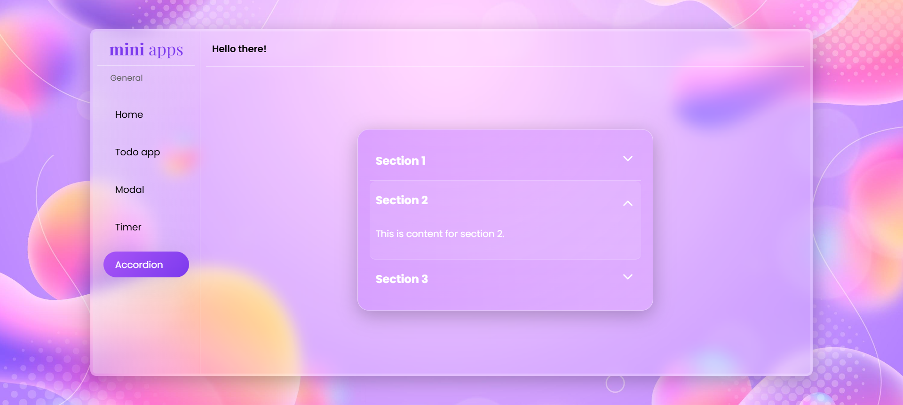
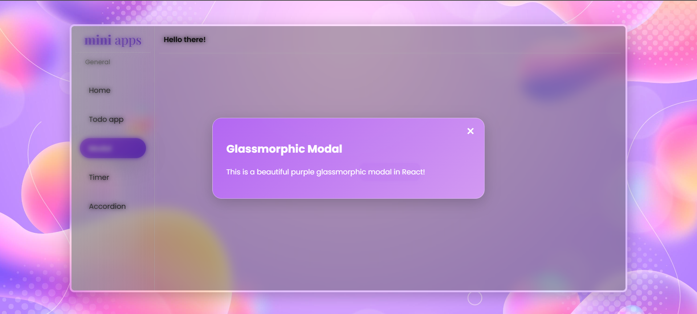
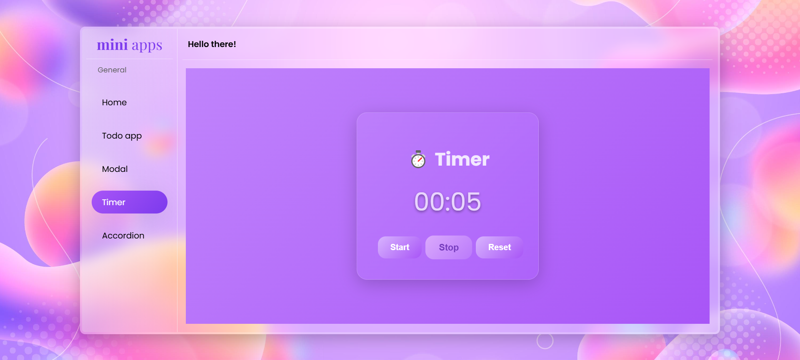
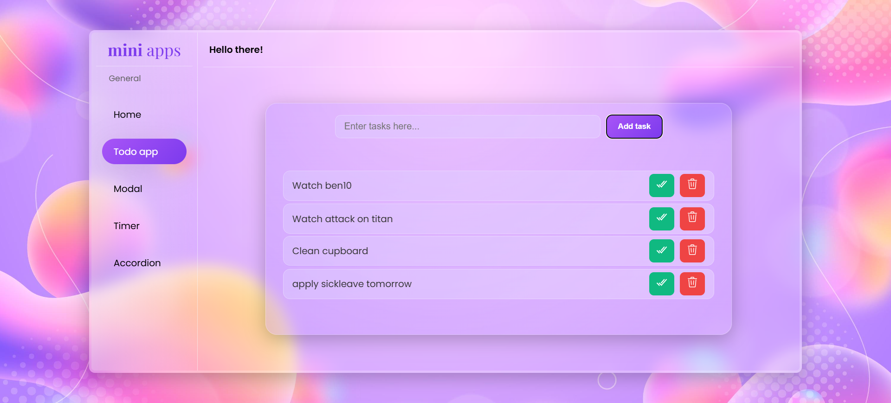

Excellent choice — let’s make it more **concise** and **professional** using a nice simple table. Here’s your clean README version:

---

# 🚀 MiniApp - React Practice Project

| Category            | What I Learnt / Built                                                                         |
| ------------------- | --------------------------------------------------------------------------------------------- |
| ⚛️ React            | Functional Components, Hooks (`useState`, `useEffect`), Props, Conditional Rendering          |
| 🎯 State Management | Todo List, Modal Open/Close, Accordion Single Open State, Timer Control                       |
| 💅 Styling          | SCSS (Nesting, Variables, Responsive), Glassmorphic Design, Gradient Backgrounds              |
| 🎨 UI Components    | Todo App, Modal, Accordion, Timer, Bento Landing Page                                         |
| 🔗 Routing          | React Router, Outlet Component                                                                |
| 🎨 Design           | Bento Grid Layout, Custom Scrollbar, Hover Effects, Smooth Transitions                        |
| 🔧 Challenges       | State Handling, Component Communication, Responsive Layouts, Reusable Components              |
| 🏆 Highlights       | Built everything from scratch, No external UI libraries, Consistent Purple Glassmorphic Theme |

---

## 🔧 Tech Stack

| Technology   | Usage          |
| ------------ | -------------- |
| React        | Core Framework |
| SCSS         | Styling        |
| React Router | Navigation     |
| React Icons  | Icons          |

## Screenshots

